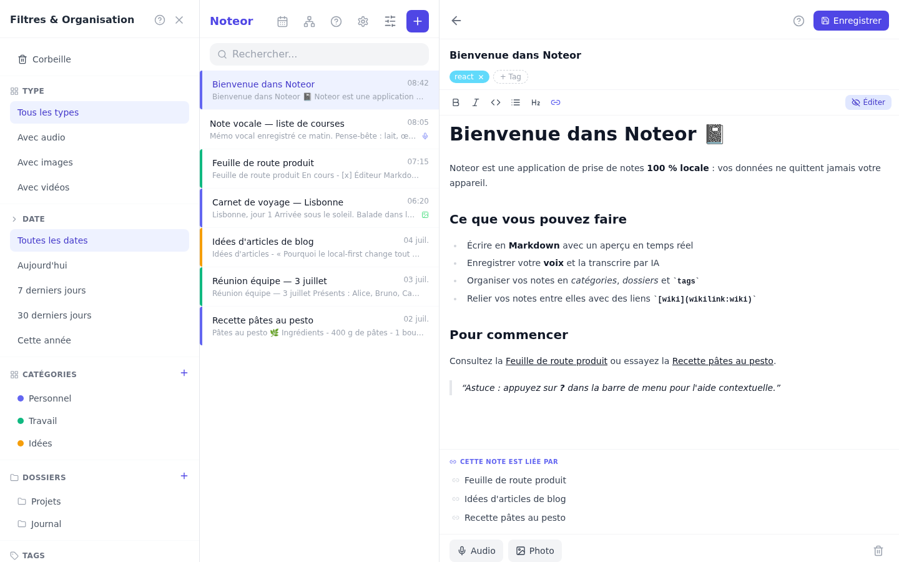
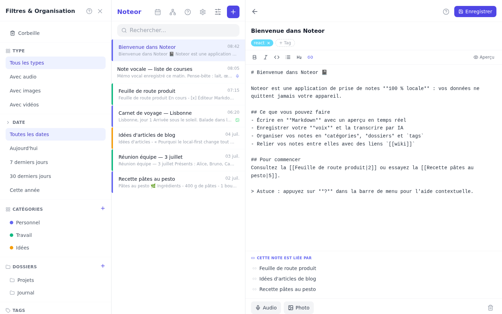
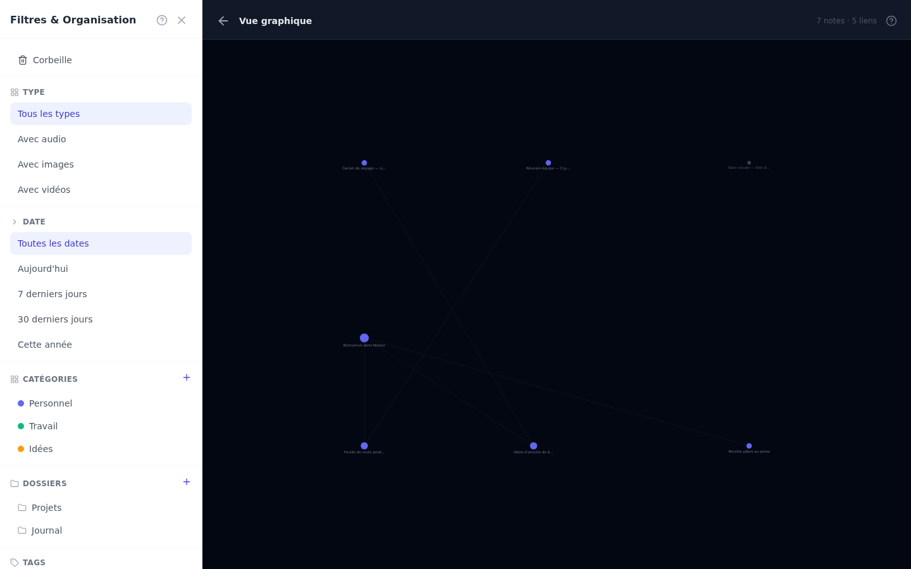
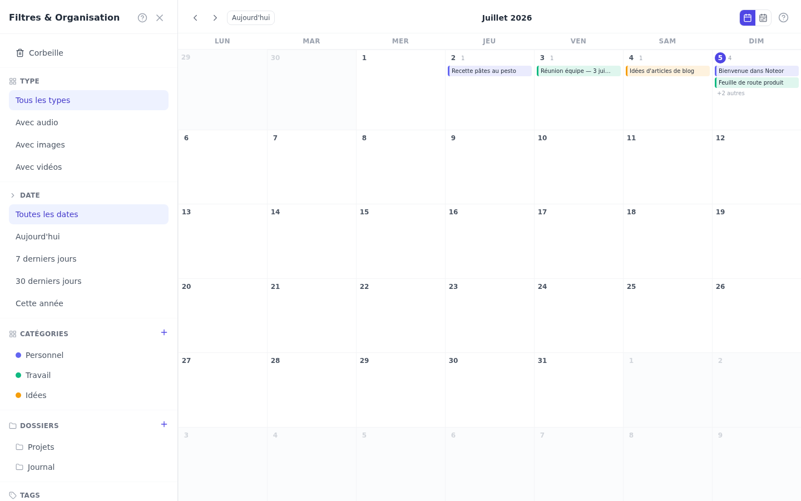
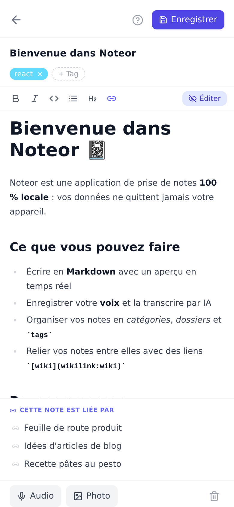

<div align="center">

# 📓 Noteor

**Application de prise de notes — 100 % locale, sans cloud**

[](https://python.org)
[](https://react.dev)
[](https://typescriptlang.org)
[](https://sqlite.org)
[](https://netlify.com)
[](LICENSE)

*Prenez des notes en Markdown, enregistrez votre voix, organisez dans des dossiers et transcrivez vos audios par IA — tout stocké localement sur votre appareil.*

</div>

---

## 🗂️ Deux versions

| | Version desktop (Python) | Version web (React) |
|---|---|---|
| **Plateforme** | Linux | Navigateur / Mobile (PWA) |
| **Stockage** | SQLite + fichiers locaux | IndexedDB (navigateur) |
| **Déploiement** | Application native | Netlify |
| **Dossier** | racine | `web/` |

---

## 📸 Captures d'écran

<div align="center">

### 🖥️ Version web — bureau



<sub>Trois panneaux — filtres & organisation · liste des notes · éditeur avec **aperçu Markdown** en temps réel, wikilinks et **backlinks** automatiques.</sub>

<br><br>



<sub>Mode édition — barre de formatage (gras, italique, code, liste, titre, lien) et liens `[[Note]]`.</sub>

<br><br>

<table>
<tr>
<td width="50%"></td>
<td width="50%"></td>
</tr>
<tr>
<td align="center"><sub><b>Graph View</b> — visualisation interactive des liens (zoom, déplacement, clic pour ouvrir).</sub></td>
<td align="center"><sub><b>Calendrier</b> — notes réparties par date, colorées selon leur catégorie.</sub></td>
</tr>
</table>

<br>

### 📱 Version web — mobile (PWA)

<table>
<tr>
<td width="50%"></td>
<td width="50%"></td>
</tr>
<tr>
<td align="center"><sub>Liste des notes — bandes de couleur par catégorie, indicateurs 🎤 audio / 🖼 image.</sub></td>
<td align="center"><sub>Éditeur plein écran — tags, aperçu Markdown et backlinks.</sub></td>
</tr>
</table>

</div>

---

## 📱 Version web — React + PWA

### Fonctionnalités

#### 📝 Notes & Édition
- Éditeur **Markdown** avec barre de formatage (gras, italique, code, liste, titre)
- **Aperçu** en temps réel du rendu Markdown
- **Auto-sauvegarde** 2,5 secondes après la dernière frappe
- **Tags colorés** — cliquer sur un tag dans l'éditeur filtre la liste

#### 📂 Organisation
- **Catégories colorées** et **dossiers** (panneau latéral)
- **Filtres** : par type de contenu, date, catégorie, dossier, tag
- **Corbeille** — suppression douce, restauration, suppression définitive

#### 🎙️ Audio & Médias
- **Enregistrement vocal** depuis le navigateur (compatible iOS / Android)
- **Import d'images** depuis la galerie ou l'appareil photo
- **Lecteur audio** intégré avec contrôles lecture / pause

#### 🤖 Transcription IA
- Connexion à **OpenRouter** (modèles gratuits `:free`)
- Bouton **IA** dans l'éditeur : transcrit l'audio enregistré et insère le texte dans la note
- Modèles recommandés : Gemini Flash, etc.

#### 💾 Import / Export
- **Export JSON** : toutes les notes avec tags et noms des fichiers joints
- **Import JSON** : chargement d'un fichier exporté, déduplication automatique

#### 📲 PWA (Progressive Web App)
- Installable sur iPhone et Android depuis le navigateur
- Fonctionne **hors connexion** après la première visite
- Icône sur l'écran d'accueil

---

### Interface web

```
Mobile                          Desktop
──────────────────              ──────────────────────────────────────────────
┌──────────────────┐            ┌────────────┬────────────┬───────────────────┐
│ Noteor  ? ⚙  ☰  │            │  Filtres   │  Liste     │  Éditeur          │
│ 🔍 Rechercher... │            │            │            │                   │
├──────────────────┤            │ Type       │ • Note 1🎤 │  Titre            │
│ • Note 1    🎤   │            │ Date       │ • Note 2   │  tag1  tag2       │
│   Contenu...     │            │ Catégorie  │ • Note 3🖼 │  ─────────────    │
├──────────────────┤            │ Dossier    │            │  Markdown...      │
│ • Note 2         │            │ Tags       │            │                   │
├──────────────────┤            │            │            │ [Audio] [Photo]   │
│ + Nouvelle note  │            │ 🗑 Corbeille│            │ [IA]              │
└──────────────────┘            └────────────┴────────────┴───────────────────┘
```

---

### Aide contextuelle

Chaque écran dispose d'un bouton **?** dans la barre de menu qui affiche une aide contextuelle :

| Écran | Contenu de l'aide |
|---|---|
| **Liste des notes** | Navigation, recherche, indicateurs audio/image |
| **Éditeur** | Markdown, tags, médias, auto-save, transcription IA |
| **Filtres** | Catégories, dossiers, tags, corbeille |
| **Paramètres** | OpenRouter, import/export |

---

### Déploiement sur Netlify

1. Forker / cloner le dépôt
2. Connecter le repo dans [Netlify](https://netlify.com)
3. Netlify détecte automatiquement `netlify.toml` :
   - **Build command** : `node scripts/generate-icons.mjs && tsc && vite build`
   - **Publish directory** : `web/dist`
4. Déployer — l'app est accessible en HTTPS avec PWA activée

---

### Développement local (web)

```bash
cd web
npm install
npm run dev        # Serveur de développement → http://localhost:5173
npm run build      # Build production (génère aussi les icônes PNG)
npm run preview    # Prévisualiser le build
```

---

### Stack technique (web)

| Composant | Technologie |
|---|---|
| Framework | React 18 + TypeScript |
| Build | Vite 6 |
| Style | Tailwind CSS v3 + @tailwindcss/typography |
| Stockage | Dexie.js (IndexedDB) |
| Markdown | react-markdown + remark-gfm |
| Icônes | lucide-react |
| PWA | vite-plugin-pwa (Workbox) |
| Icônes app | SVG + sharp (PNG auto-généré) |
| IA | OpenRouter API (modèles `:free`) |

---

### Structure du projet web

```
web/
├── public/
│   ├── icon.svg              # Icône source SVG
│   ├── pwa-192.png           # Icône PWA 192×192 (auto-générée)
│   ├── pwa-512.png           # Icône PWA 512×512 (auto-générée)
│   └── apple-touch-icon.png  # Icône iOS 180×180 (auto-générée)
├── scripts/
│   └── generate-icons.mjs    # Génération des PNG depuis icon.svg (sharp)
├── src/
│   ├── db/
│   │   └── index.ts          # Couche Dexie/IndexedDB + export/import JSON
│   ├── types/
│   │   └── index.ts          # Interfaces TypeScript
│   ├── services/
│   │   └── openrouter.ts     # API OpenRouter (modèles + transcription)
│   └── components/
│       ├── NoteList.tsx      # Liste des notes avec recherche et filtres
│       ├── NoteEditor.tsx    # Éditeur Markdown + tags + médias + IA
│       ├── Sidebar.tsx       # Panneau filtres & organisation
│       ├── Settings.tsx      # Paramètres OpenRouter + import/export
│       ├── AudioRecorder.tsx # Enregistrement et lecture audio
│       ├── TagChip.tsx       # Composant tag cliquable
│       └── HelpModal.tsx     # Modal d'aide contextuelle (réutilisable)
├── netlify.toml              # Config Netlify (build + redirects SPA + headers)
├── vite.config.ts
├── tailwind.config.js
└── package.json
```

---

## 🖥️ Version desktop — Python / Linux

### Fonctionnalités

- Éditeur **Markdown** avec aperçu HTML en temps réel
- **Enregistrement audio** (arecord/ALSA + sounddevice)
- **Capture d'écran** (portail XDG — Wayland & X11)
- **Enregistrement webcam** (ffmpeg + V4L2)
- **Import** images et vidéos
- **Export PDF** (Qt PrintSupport)
- **Tags**, **catégories** et **dossiers** hiérarchiques
- **Corbeille** avec restauration
- Aide intégrée (`F1`)

### Interface desktop

```
┌─────────────────┬─────────────────┬────────────────────────────────┐
│  📂 Dossiers    │  📋 Liste notes  │  📝 Éditeur                    │
│  🏷 Catégories  │                  │                                │
│  Tags           │  • Ma note 1 🎤  │  Titre de la note              │
│  Filtres        │  • Ma note 2 🖼  │  ─────────────────────────     │
│  🗑 Corbeille   │  • Ma note 3 🎬  │  Contenu en **Markdown**...    │
│                 │                  │                                │
│                 │                  │  [Pièces jointes]              │
└─────────────────┴─────────────────┴────────────────────────────────┘
```

### Installation (Linux)

```bash
# Prérequis
sudo apt install python3 python3-pip python3-venv \
                 alsa-utils python3-dbus python3-gi ffmpeg

# Installation
git clone https://github.com/nouhailler/Noteor.git
cd Noteor
python3 -m venv venv
source venv/bin/activate
pip install -r requirements.txt

# Lancement
python3 main.py
```

### Raccourcis clavier

| Raccourci | Action |
|---|---|
| `Ctrl+N` | Nouvelle note |
| `Ctrl+S` | Sauvegarder |
| `Ctrl+E` | Exporter en PDF |
| `F1` | Aide complète |
| `F5` | Actualiser |
| `Ctrl+Q` | Quitter |

### Données locales

```
~/.local/share/Noteor/
├── notes.db           # Base SQLite
└── media/
    ├── audio/         # Enregistrements WAV
    ├── images/        # Images et captures
    ├── thumbnails/    # Miniatures
    └── video/         # Vidéos
```

### Stack technique (desktop)

| Composant | Technologie |
|---|---|
| Interface | PyQt6 |
| Base de données | SQLite (WAL mode) |
| Markdown | `markdown` |
| Images | Pillow + Qt |
| Audio | `arecord` / `aplay` + `sounddevice` |
| Capture d'écran | Portail XDG (D-Bus / gi) |
| Vidéo | `ffmpeg` + V4L2 |
| Export PDF | Qt PrintSupport |

---

## 📃 Licence

[MIT](LICENSE) — Noteor est un logiciel libre.
